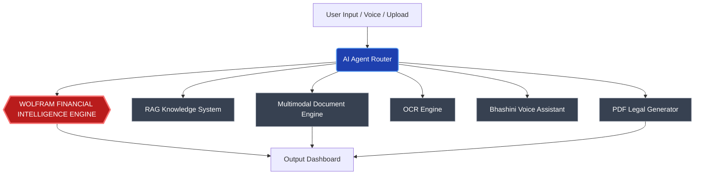
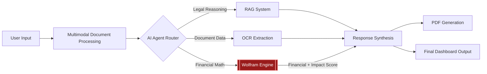

# VARASAT
### AI-Powered System for Discovery, Recovery & Resolution of Unclaimed Family Assets

*"Transforming forgotten financial assets into recovered family dignity."*

---

## 🛑 Problem Statement

In India, an estimated **₹1.5 Lakh Crore ($18B+)** in unclaimed deposits, insurance policies, and mutual funds is lying dormant. 
When a family member passes away, their grieving families lose access to these hard-earned assets because:
- **Fragmented Systems**: Every bank, insurer, and provident fund has a different, opaque recovery process.
- **Complexity**: The intersection of rigid legal procedures, rigid financial requirements, and legacy documentation completely blocks ordinary citizens.
- **Lack of Guidance**: There is no unified, intelligent system to guide users—forcing them to rely on expensive intermediaries.

## 💡 Proposed Solution (Varasat)

**Varasat** is an end-to-end, AI-powered multi-agent ecosystem designed to completely democratize inheritance recovery. It acts as a unified legal and financial brain that:
1. **Extracts** structured data directly from legacy, handwritten, or scanned financial documents.
2. **Explains** step-by-step legal claim processes using intelligent reasoning.
3. **Computes** the true financial cost of delayed recovery using the Wolfram Language.
4. **Generates** the exact legal documents (affidavits, indemnities) needed to claim the money.
5. **Supports** regional voice-based interactions to ensure accessibility for all users.

---

## ✨ Key Features

- **🧠 AI Agent Router**: The intelligent orchestrator that accurately routes user queries and documents to the correct specialized modules.
- **👁️ Multimodal Document Intelligence Engine**: Reads scanned legacy documents, extracts handwritten and printed text, detects institutional stamps, and proactively flags validation anomalies (e.g., blurred text, missing dates).
- **📚 RAG Knowledge System**: A robust semantic retrieval system providing legally grounded inheritance rules, specific claim procedures, and precise document requirements.
- **⚙️ Wolfram Financial Intelligence Engine**: The definitive core computational engine handling complex inflation-adjusted value calculations, multi-variable financial forecasting, and delay impact modeling.
- **👨‍👩‍👧 Family Impact Loss Calculator [NEW]**: Translates abstract financial loss into tangible human impact metrics (e.g., grocery equivalents, education costs, medical expense equivalence) with a 0–100 Family Survival Impact Score.
- **📄 OCR + Document Processing**: Parses and extracts highly structured JSON data from unpredictable PDFs and images.
- **🖨️ Automated PDF Generator**: Automatically drafts and compiles ready-to-print legal affidavits and claim documents based on extracted data.
- **🗣️ Voice Assistant (Bhashini)**: Full multilingual interaction support (Hindi, Kannada, English) ensuring barrier-free access.

---

## 🏗️ System Architecture

---

## 🔄 Data Flow Pipeline

---

## 🔴 The Role of Wolfram (Core Intelligence Layer)

In Varasat, **Wolfram is NOT a background utility tool**. It is the central Financial Intelligence Core. 

Large Language Models (LLMs) are strictly barred from performing financial mathematics to prevent hallucinations. Instead, **Wolfram exclusively handles**:
- Inflation decay modeling and real-world purchasing power adjustments.
- Time-based financial loss computation using compound discounting.
- Delay impact severity scoring.
- Future asset value projection.

> *"At least 20–30% of Varasat's system intelligence is powered directly by the Wolfram Language for deterministic, infallible financial reasoning."*

---

## 📉 Family Impact Loss Calculator

Varasat goes beyond simple calculators by converting raw financial data into empathetic, actionable human insights.

| Input Variables | Output Computations | Real-World Translation |
| :--- | :--- | :--- |
| • Original Asset Amount • Years Unclaimed • Asset Type | • Present Value (Inflation Adjusted) • Total Financial Loss (₹) • Family Impact Score (0–100) | • Months of family groceries lost • Years of child education lost • Equivalent major healthcare costs lost |

### 🔍 Sample Input → Output Transformation

**Input Extracted:**
- Asset: `₹5,00,000` (Fixed Deposit)
- Status: `10 years unclaimed`

**Wolfram Computed Output:**
- **Present Value**: `₹2,79,197` (Inflation Adjusted)
- **Total Loss**: `₹2,20,803`
- **Delay Impact Score**: `100/100` (Critical)
- **Human-Readable Insight**: *"Your grandfather's fixed deposit has lost ₹2,20,803 in real purchasing power due to 10 years of inflation. To put that into perspective, that lost value is equivalent to **44 months of family groceries** or almost **a full year of school fees**. Let's recover the remaining ₹2,79,197 immediately."*

---

## 🌍 Social Impact

Varasat is built to serve the most vulnerable segments of society:
- **Helps Rural Families**: Regional voice integration allows users with no English proficiency to navigate complex legal webs.
- **Supports Elderly Users**: Empathetic AI guidance reduces anxiety and confusion.
- **Eliminates Predatory Intermediaries**: By automating legal document drafting and exact claim procedures, families no longer need to pay exorbitant agent fees.
- **Improves Financial Inclusion**: Reintegrates billions of dormant capital back into the active economy and into the hands of rightful heirs.

---

## 💻 Tech Stack

- **Frontend**: React, TailwindCSS, Recharts
- **Backend**: Node.js, Express
- **AI Orchestration**: Custom LLM-based Multi-Agent Router (Groq / Llama-3)
- **RAG System**: TF-IDF Semantic Document Retrieval 
- **Financial Computation**: Wolfram Language / WolframScript
- **Multimodal Intelligence**: Gemini 2.0 Flash (OCR + Vision Validation)
- **Voice Capabilities**: Web Speech API & Bhashini 
- **Legal Document Engine**: PDFKit

---

## 🚀 Future Scope

- **Government DigiLocker Integration**: Direct fetching of death certificates and legal heir documents.
- **Banking API Partnerships**: Secure integration with banking protocols to automatically verify dormant account statuses.
- **National Inheritance Registry**: A unified ledger for family financial tracing.
- **Advanced Regional Expansion**: Broadening the Bhashini integration to cover all 22 scheduled Indian languages.
- **AI Legal Advisory System**: Adding predictive models for civil court succession timelines.