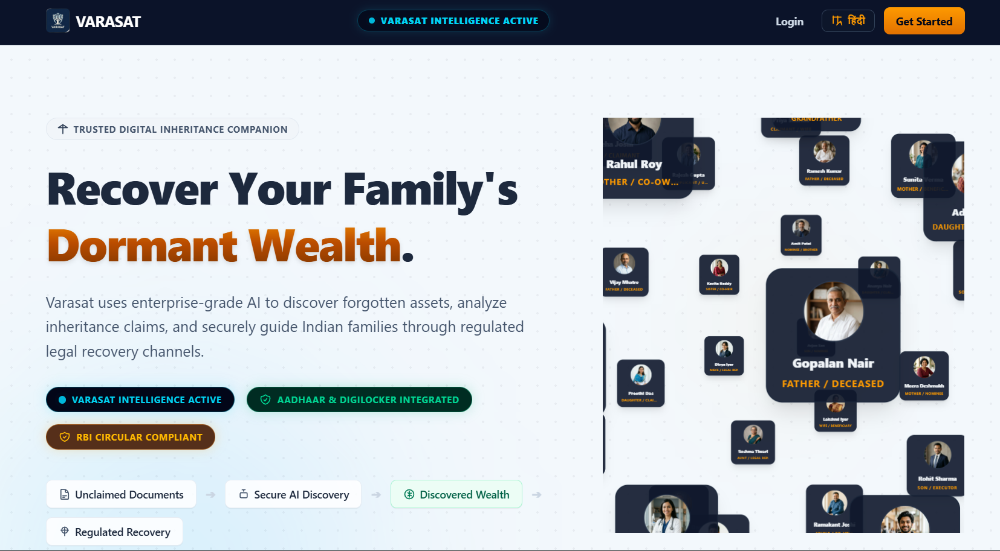
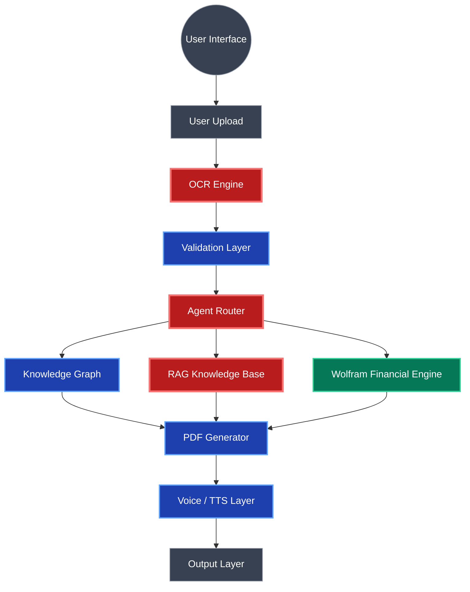
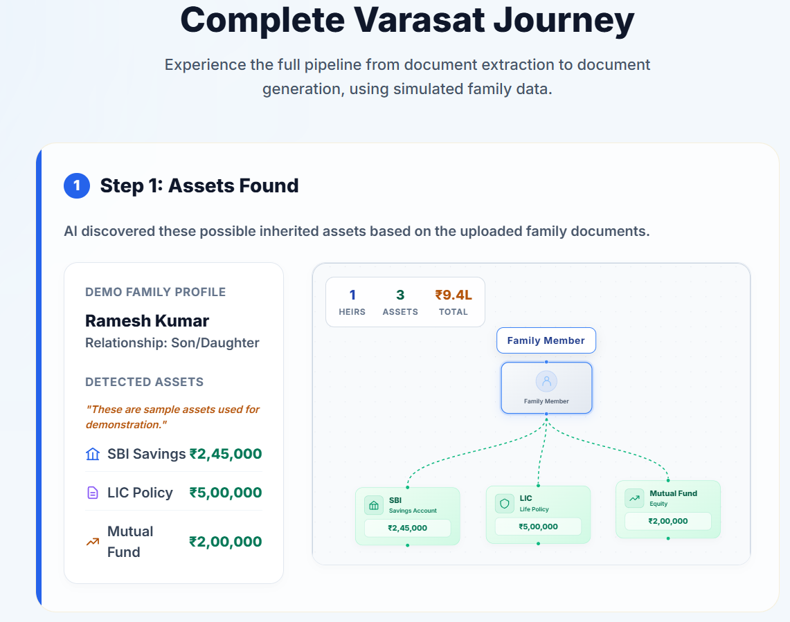
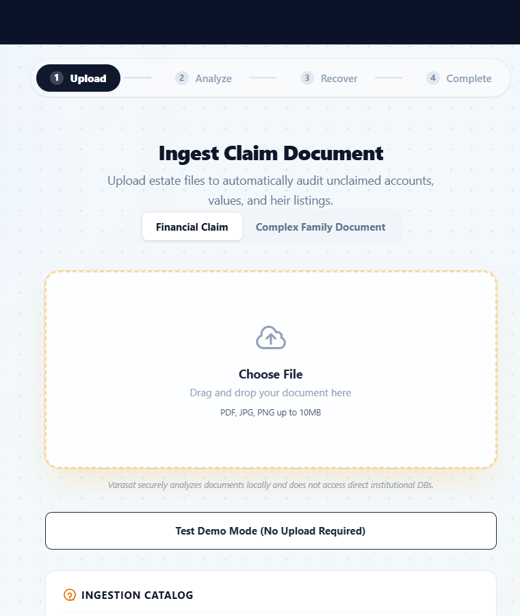
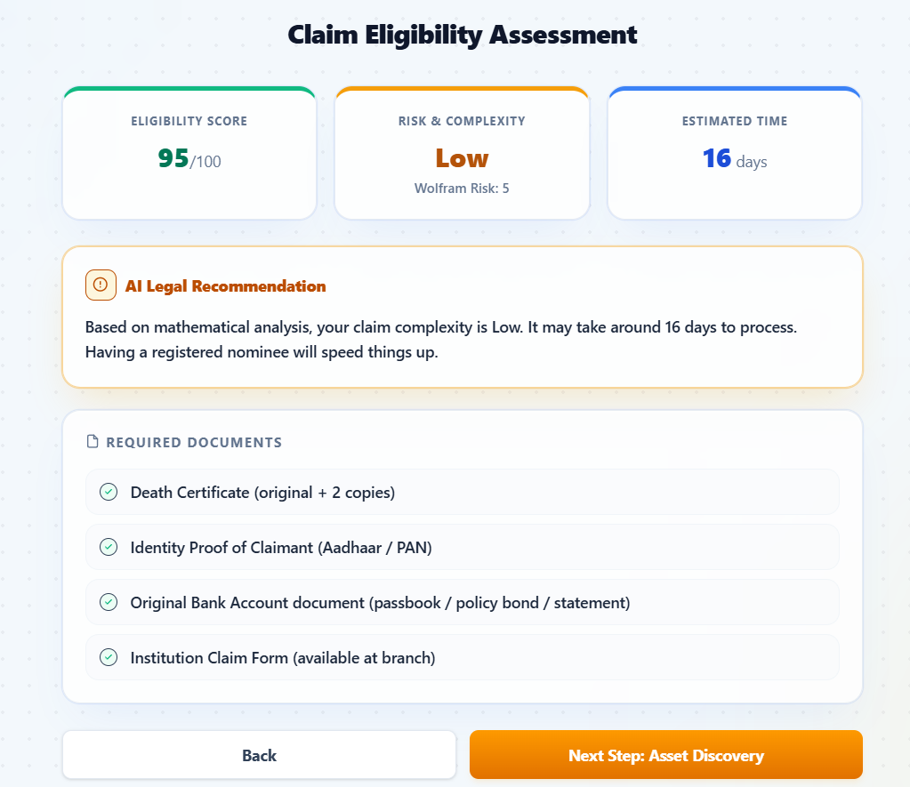
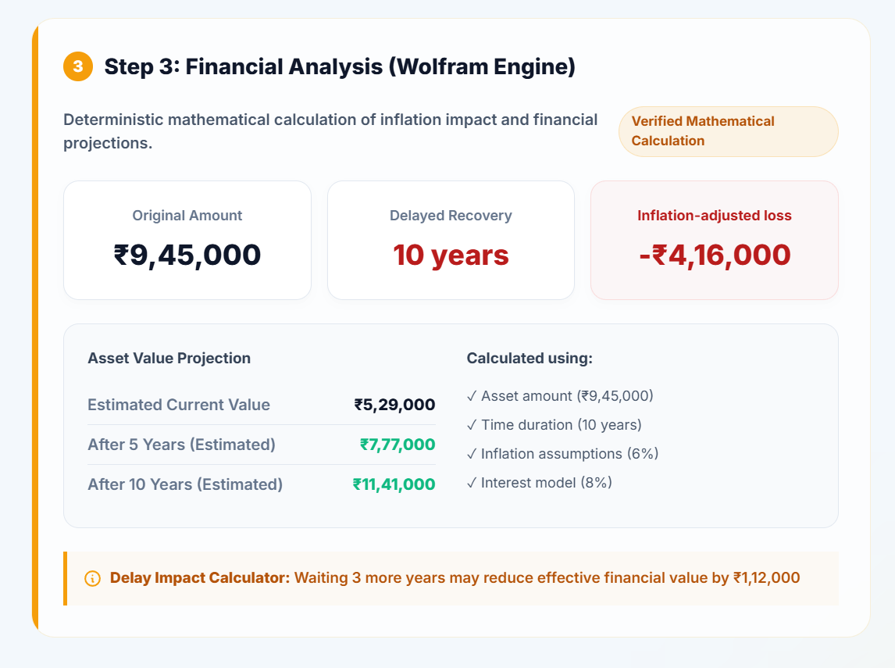
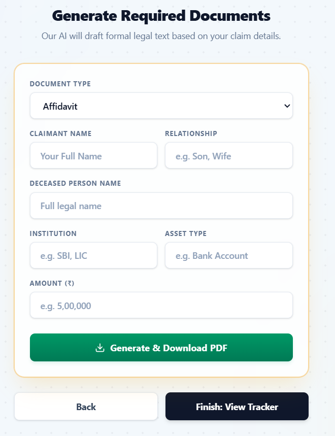

# VARASAT

<div align="center">
  
  <br/>
  <i>VARASAT helps families discover, analyze, and recover dormant financial assets through a guided inheritance recovery workflow.</i>
</div>
<br/>


VARASAT is an open-source inheritance discovery platform. It processes fragmented, legacy financial documents using optical character recognition (OCR), maps the relationships into a structured knowledge graph, and provides localized audio explanations to assist families in identifying unclaimed assets.

## 🎥 Demo Video

Watch the complete end-to-end VARASAT workflow:

👉 [Demo Video](INSERT_VIDEO_LINK_HERE)

The demo showcases:
- Document Upload & OCR
- Knowledge Graph Generation
- Wolfram Financial Analysis
- Claim Eligibility Assessment
- Legal Document Generation
- Multilingual Guidance

**Duration:** 3–4 minutes

## Key Features
* **OCR-based document extraction:** Digitizes fading or unstructured legacy records.
* **Knowledge graph construction:** Maps complex family and asset relationships visually.
* **Legal procedure retrieval:** Fetches procedural steps securely via RAG.
* **Deterministic financial calculations:** Calculates indicative inflation adjustments off-LLM.
* **Automated document generation:** Outputs pre-filled PDF templates.
* **Multilingual audio guidance:** Accessible TTS natively in the browser.

## Table of Contents
1. [Problem Statement](#problem-statement)
2. [Solution Overview](#solution-overview)
3. [System Architecture](#system-architecture)
4. [End-to-End Workflow](#end-to-end-workflow)
5. [Validation & Safety](#validation--safety)
6. [Technical Innovations](#technical-innovations)
7. [Why Wolfram](#why-wolfram)
8. [Example Workflow](#example-workflow)
9. [Financial Intelligence Layer](#financial-intelligence-layer)
10. [Family Impact Calculator](#family-impact-calculator)
11. [Technology Stack](#technology-stack)
12. [Challenges & Design Decisions](#challenges--design-decisions)
13. [Social Impact](#social-impact)
14. [Demo Highlights](#demo-highlights)
15. [Future Scope](#future-scope)

---

## Problem Statement

In India, an estimated ₹1.5 Lakh Crore ($18B+) in deposits, insurance policies, and mutual funds sits unclaimed.

When a family member passes away, tracing and recovering these assets is highly inefficient:
- **Scale of Unclaimed Assets:** The sheer volume of dormant capital represents a massive, unaddressed financial systemic issue.
- **Why Recovery is Difficult:** Assets are distributed across non-interoperable banking and insurance systems with complex, obscure procedural requirements.
- **Existing Limitations:** Current recovery platforms typically require manual data entry, assume a high level of digital literacy, require English proficiency, and lack the capability to automatically trace relational links between isolated documents.

## Solution Overview

VARASAT is a document-processing and graph-mapping pipeline designed to assist in inheritance recovery. 

- **What the system does:** It ingests raw financial documents (scans, PDFs), extracts key entities via OCR, routes queries via AI agents, constructs a relational graph linking family members to assets, calculates financial estimates, and outputs a localized, text-to-speech explanation alongside generated legal PDFs.
- **Who it helps:** Grieving families, rural citizens, and low-literacy users who would otherwise depend on costly intermediaries.
- **End-to-end workflow:** A user uploads disorganized documents, the system processes and validates the data, retrieves relevant legal procedures, calculates financial metrics, and provides a clear audio-visual summary and actionable PDF forms.

---

## System Architecture



## End-to-End Workflow


---

## Validation & Safety

VARASAT is engineered with strict safeguards to ensure users receive helpful guidance without being misled:
- **No Legal Advice:** VARASAT explicitly does not provide certified legal counsel.
- **Procedural Guidance Only:** Outputs represent publicly available procedural guidelines, not legally binding determinations.
- **Indicative Financials:** All financial calculations (inflation decay, future value) are indicative estimates designed for conceptual understanding.
- **Verification Required:** Generated documents are drafts; users are consistently advised to verify all claims and consult relevant authorities or legal professionals before filing.

---

## Technical Innovations

### 1. OCR + Entity Extraction
- **Problem:** Extracting relational data from non-standardized, degraded, or handwritten legacy Indian financial documents.
- **Approach:** Employs Gemini Vision OCR to parse unstructured text and detect institutional stamps.
- **Why It Matters:** Automates the most labor-intensive step of inheritance discovery—digitizing decades-old paperwork.

### OCR Extraction Result

TODO: Add screenshot showing:
- Input document
- Extracted entities
- Structured output

### 2. Knowledge Graph Construction
- **Problem:** Isolated documents provide no context regarding overall family wealth distribution.
- **Approach:** Named Entity Recognition (NER) outputs are mapped into an in-memory graph connecting Person, Asset, and Document nodes via defined edges.
- **Why It Matters:** Transforms flat text into a queryable, relational data structure for tracing inheritance paths.

<br/>
<div align="center">
  
  <br/>
  <i>Extracted entities are organized into a relationship graph connecting family members, assets, and institutions.</i>
</div>
<br/>

#### Example Graph Structure
```text
Person (Grandfather)
│
├── Owns
│
Asset (Fixed Deposit)
│
├── Referenced In
│
Document (FD Certificate)
```
*Graph representation is useful because it allows the system to deterministically find the shortest path between a deceased asset holder and the current claimant across multiple disjointed documents.*

### 3. Agent Routing
- **Problem:** Hardcoded logic fails to gracefully handle the wide variance in user queries and document types.
- **Approach:** Implements an LLM-based semantic router that classifies input intent and directs execution to specialized sub-agents.
- **Why It Matters:** Ensures high precision in processing paths, minimizing the risk of misapplying legal procedures.

### 4. RAG Retrieval
- **Problem:** LLMs cannot reliably cite specific local inheritance laws without hallucinating.
- **Approach:** A TF-IDF based Retrieval-Augmented Generation system fetches exact, verified legal procedures from a localized JSON/Markdown knowledge base.
- **Why It Matters:** Grounds all procedural advice in verified documentation.

### 5. Financial Computation Isolation
- **Problem:** Large Language Models are highly prone to hallucination when performing arithmetic or financial forecasting.
- **Approach:** Time-value computations and graph centrality heuristics are delegated to a dedicated mathematical engine.
- **Why It Matters:** Ensures that displayed asset values and inflation adjustments are mathematically reproducible rather than probabilistically generated.

### 6. Multilingual Accessibility
- **Problem:** Delivering low-latency, localized audio without incurring heavy API costs or network delays.
- **Approach:** Leverages the native `window.speechSynthesis` API for English and Hindi text-to-speech output.
- **Why It Matters:** Increases accessibility for low-literacy users while maintaining a highly responsive, offline-capable playback architecture.

---

## Why Wolfram

VARASAT utilizes the Wolfram Language specifically to handle tasks that probabilistic models (like LLMs) fail at:
- **Deterministic Computation:** Mathematical operations must yield the same result 100% of the time, which LLMs cannot guarantee.
- **Separation of Concerns:** By explicitly separating logic into text-generation (LLM) and mathematics (Wolfram), we drastically reduce the risk of hallucinated values.
- **Inflation & Purchasing Power:** Safely calculates the compound growth (or decay) of assets over decades using formalized discounting formulas.
- **Financial Impact Estimation:** Executes the formulas required to estimate equivalent purchasing power losses without manual data manipulation.

---

## Example Workflow

**Step 1: Upload & Extraction**
The user uploads a JPEG of a 15-year-old bank Fixed Deposit certificate.

<br/>
<div align="center">
  
  <br/>
  <i>Users upload estate-related documents for automated extraction and analysis.</i>
</div>
<br/>

**Step 2: OCR Extraction** 
The vision module processes the image, extracting the principal amount (₹50,000), date of issue (2011), and the account holder's name.

**Step 3: Validation** 
Regex patterns and schema validation confirm the extracted fields match expected banking formats.

**Step 4: Claim Assessment & Agent Routing** 
The router categorizes the document as a "Banking Asset" and forwards the context to the legal retrieval module.

<br/>
<div align="center">
  
  <br/>
  <i>The system evaluates claim complexity, estimated processing time, and required supporting documents.</i>
</div>
<br/>

**Step 5: Knowledge Retrieval** 
The RAG system fetches the standard procedure for claiming a matured FD for a deceased individual.

**Step 6: Financial Computation** 
The computational module calculates the indicative inflation-adjusted present value of the 2011 principal.

**Step 7: Document Generation** 
PDFKit generates an indicative, pre-filled generic indemnity bond template.

**Step 8: User Output** 
The frontend renders the visual node graph, the calculated present value, and plays a localized TTS audio track explaining the required next steps.

---

## Financial Intelligence Layer

Financial calculations are strictly separated from the generative text models to prevent mathematical hallucinations. 

<br/>
<div align="center">
  
  <br/>
  <i>Deterministic financial calculations estimate inflation-adjusted value, delay impact, and recovery projections.</i>
</div>
<br/>

VARASAT implements a computational module that handles:
- **Inflation-adjusted valuation:** Calculates the indicative present value (PV) of historical assets based on standardized inflation rates.
- **Delay-loss computation:** Estimates the absolute nominal loss in purchasing power over the dormant period.
- **Ownership Relevance Scoring:** A deterministic heuristic based on graph edges. It weights identity matching, family linkage depth, and document completeness to generate an indicative score representing the likelihood of a claim link.

*Note: All financial metrics generated are strictly indicative estimates and do not guarantee exact payouts or establish legal ownership.*

## Family Impact Calculator

The Family Impact Calculator translates nominal financial losses into tangible purchasing power equivalents to provide contextual understanding.

- **Inputs:** Original asset value, years dormant, and an estimated regional inflation rate.
- **Outputs:** Indicative present value, purchasing power loss, and human-readable equivalence.
- **Computation methodology:** Calculates lost purchasing power (Future Value - Nominal Value) and divides it by hardcoded regional consumer baselines.
- **Human-readable interpretation:** An indicative metric (e.g., "Equivalent to 44 months of average groceries"). All outputs are strictly indicative estimates designed for conceptualization.

---

## Technology Stack

| Component | Technology | Purpose |
| :--- | :--- | :--- |
| **Frontend** | React, Vite, TailwindCSS | High-performance, responsive user interface. |
| **Backend** | Node.js, Express | API routing, orchestration, and file handling. |
| **OCR Engine** | Gemini 2.0 Flash | Extracting text and entities from unstructured images/PDFs. |
| **Agent Router** | Groq (Llama-3) | Fast intent classification and natural language summarization. |
| **Math Engine** | Wolfram Language / Node.js | Deterministic financial computation and graph heuristics. |
| **Voice / TTS** | Web Speech API | Zero-latency, client-side multilingual text-to-speech. |
| **Document Gen** | PDFKit | Automated generation of indicative legal claim templates. |

---

## Challenges & Design Decisions

- **OCR Quality Issues:** Legacy Indian documents often feature faded ink and mixed English/regional scripts. We implemented confidence thresholds requiring clear user validation.
- **Hallucination Reduction:** To prevent the AI from generating incorrect legal advice or math, we hard-separated the architecture. LLMs only format text; RAG handles legal retrieval; Wolfram/Node handles math.
- **Legal Retrieval Limitations:** The system retrieves procedures based on general guidelines. It explicitly includes disclaimers that outputs are procedural assistance, not certified legal counsel.
- **Multilingual Constraints:** We opted for the browser's native `SpeechSynthesis` over cloud TTS providers to eliminate latency and reduce deployment complexity.
- **Financial Calculation Reliability:** By offloading math to a deterministic engine, we improved reliability, though all outputs remain strictly indicative due to fluctuating real-world banking rates.

---

## Social Impact

VARASAT targets systemic barriers in inheritance recovery:
- **Rural Accessibility:** Low-bandwidth optimization and voice-first interaction lowers digital barriers.
- **Elderly Accessibility:** Simple visual graphs and audio instructions replace dense legal text.
- **Reduced Dependency on Intermediaries:** By automating procedural discovery and document drafting, families avoid exorbitant broker fees.
- **Financial Inclusion:** Assists in recirculating dormant, forgotten capital back into the active economy and the hands of rightful heirs.

---

## Demo Highlights

### Document Generation

<div align="center">
  
  <br/>
  <i>Required legal documents can be generated using extracted claim information.</i>
</div>
<br/>

**Input:** A smartphone photograph of a 1995 handwritten land registry document.  
**Processing:** The OCR engine digitizes the text, the Agent Router classifies it as real estate, and the Financial Engine calculates a 29-year indicative inflation adjustment.  
**Output:** A clean, interconnected visual graph showing the relationship between the grandfather (document owner) and the current user, alongside an audio explanation.  
**User Benefit:** Reduces manual document tracing time from weeks to seconds and provides immediately actionable, localized guidance, completely free of charge.

---

## Future Scope

- Direct government API integration with DigiLocker for automated fetching of verified death certificates.
- Expanded language coverage utilizing the Bhashini API for all 22 scheduled Indian languages.
- Implementation of cryptographic hashing for uploaded documents to maintain a tamper-evident audit trail.